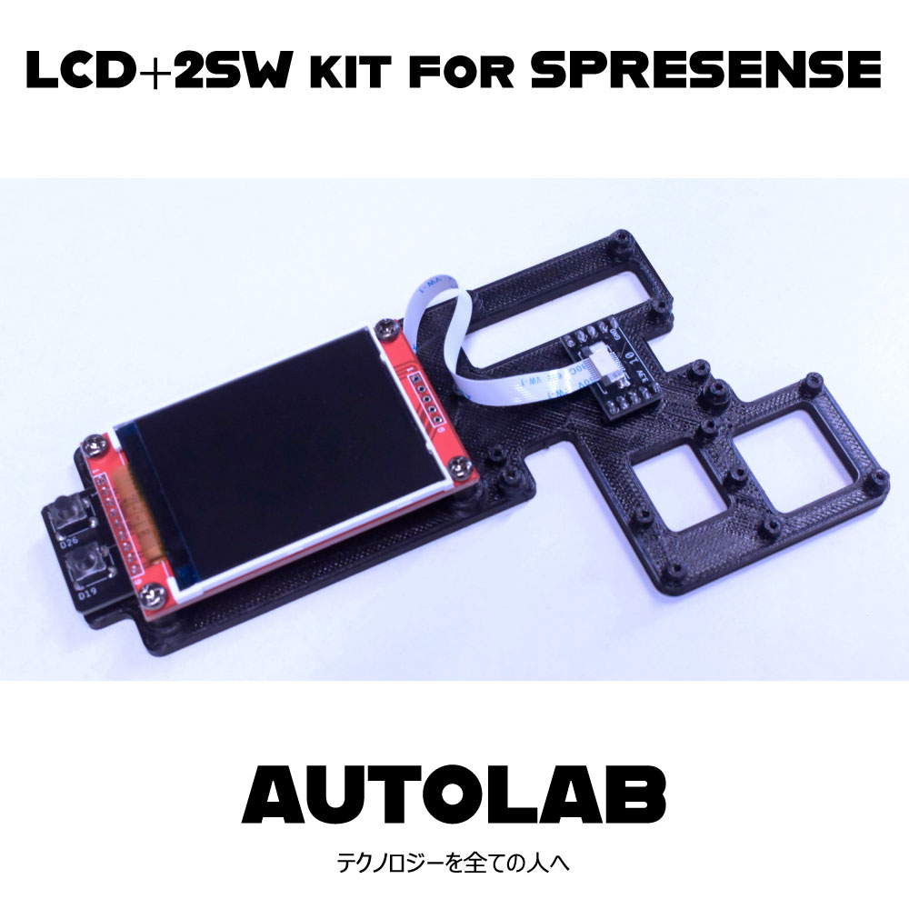
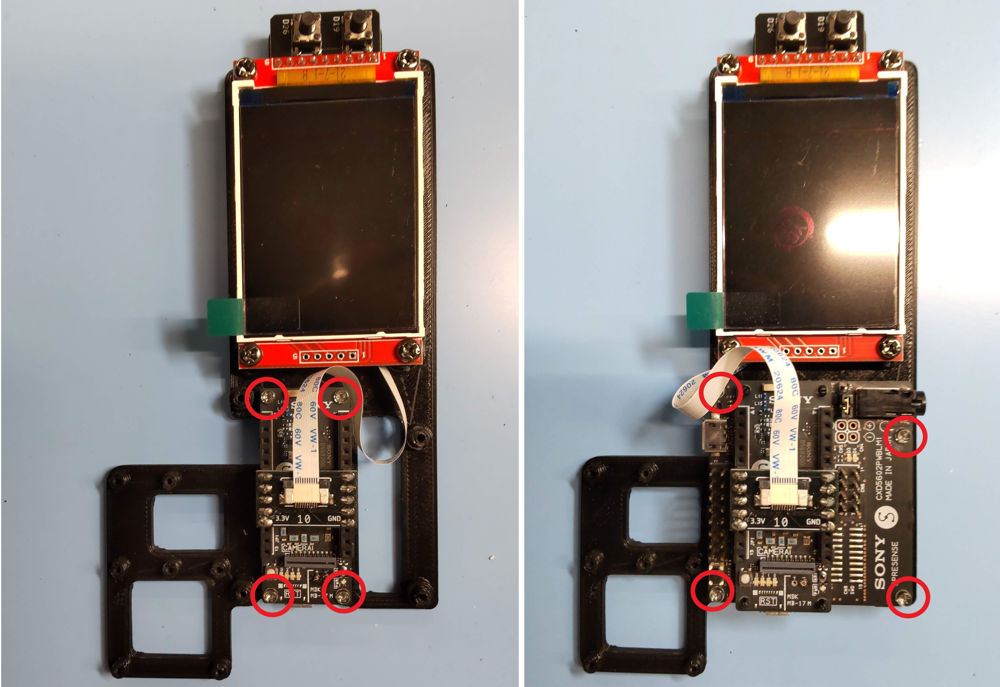
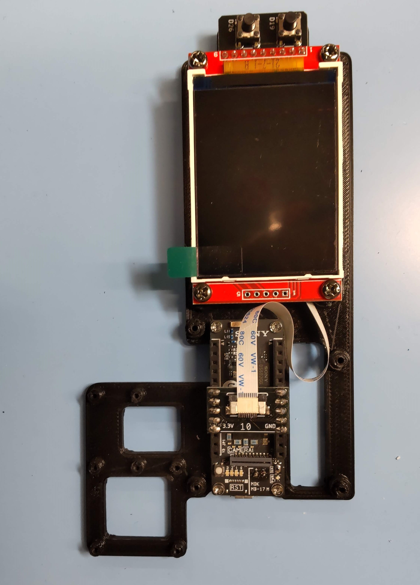

# LCD-2SW_kit_for_SPRESENSEサポートページ

## 【概要】

SPRESENSEメインボードとSPRESENSE LTE拡張ボード用のLCDにスイッチがついた基板キットで、テストプロダクトに最適です。ハンダ付け済みですぐに使い始めることができます。

サンプルコードによる動作確認を全数実施しています 。

## 【仕様】

+ スイッチ２個付きLCD基板
+ LCD仕様
+ 2.2インチ
+ ili9341ドライバ搭載
+ SPI接続
+ 240ｘ320
+ 3.3V電源（5Vを接続しないようにしてください）
+ タクトスイッチ2個搭載 D26, D19に接続
+ 10ピンＦＦＣコネクタ
+ サイズ 80ｘ40ｘ12 mm

### 【メイン接続基板】
+ 10ピンＦＦＣコネクタ
+ サイズ 22ｘ12ｘ8 mm

### 【FFCケーブル】
+ 0.5ピッチ　10ピン　長さ150 mm

## 【特徴】
+ メイン接続基板からFPCケーブルにてスイッチ2個付きLCD基板に接続
+ 梱包台に固定し、SPRESENSEメインボードとSPRESENSE LTE拡張ボード、カメラボードを取り付け可能です。
*カメラボード取付の際はM2並目ねじを4つご用意ください
+ Mic-kit for SPRESENSE_LTEと組み合わせ可能です
+ FFCケーブルはデリケートな部品ですので取り扱いご注意ください

## 【内容】
+ 1x メイン接続基板
+ 1x スイッチ2個付きLCD基板
+ 1x FPCケーブル（接続済み）
+ 1x 梱包兼、SPRESENSE台（3Dプリント品）
+ 4x M3並目ねじ（黄銅、LCD基板を台に固定するのに使っています）
+ 4x M2並目ねじ（PC、SPRESENSE固定用）

## 使い方
### 1.SPRESENSEの固定

SPRESENSEメインボード、もしくはLTE拡張基板をご用意ください
*本キットには含まれておりません
*LTE拡張基板がなくても、動作可能です

下図のように付属のネジにて、SPRESENSEを固定してください

### 2.LCDを接続
下図のように、LCDを接続してください

### 3.結線の説明
下記のようにLCDと接続されます

| SPRESENSE | Kit LCD |
| ---- | ----|
| 3.3V | LED、3.3V|
| GND | GND|　
| D26 | SW |
| D24 |　CS |
| D25 | DC |
| D23 | SCK |
| D19 | SW |
| D18 | RESET|
| D16 | SDI |
| D17 | SDO |　　　　

### 4.サンプルコード
下記のサンプルコードが利用可能です
*サンプルコードのサポートはしておりません

SPRESENSE SDK によるサンプルコード
https://github.com/sonydevworld/spresense/blob/master/examples/dsc/README.txt?fbclid=IwAR0_vmce_N4uS75KHTwVmGOV5lMOFthvF2UpiGuHly2eQa9HiIT0s3T-5no
